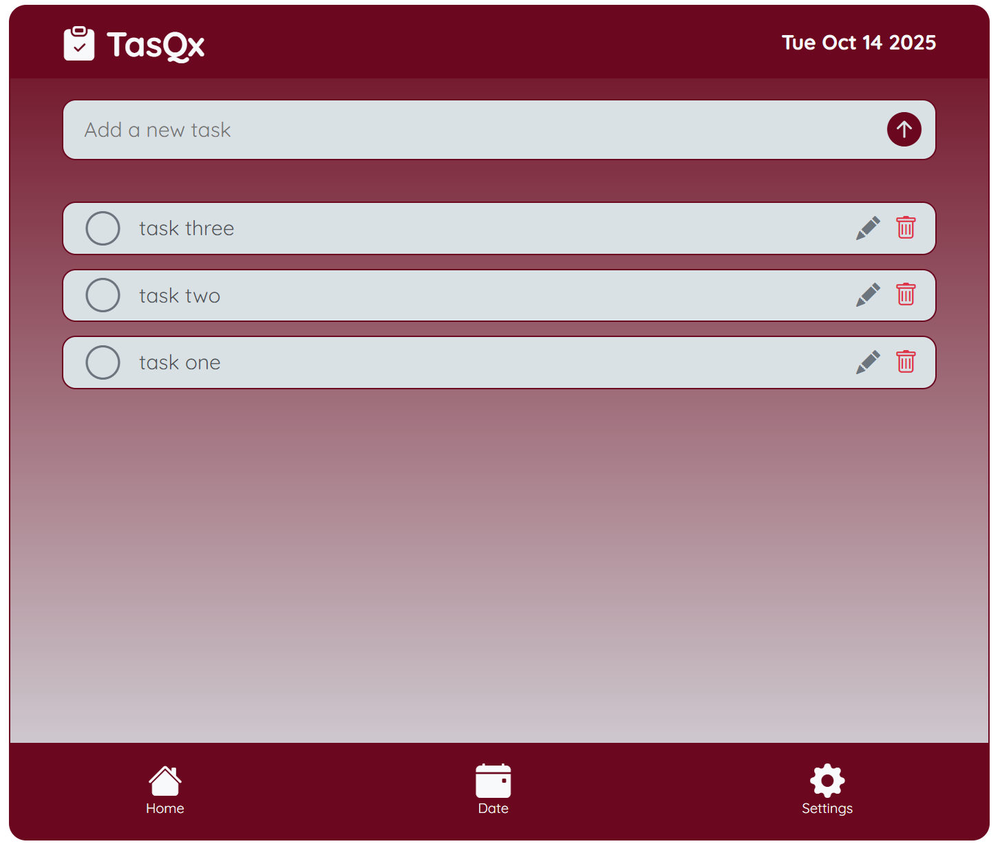

A lightweight, accessible, interactive TODO list application built with TypeScript, modular components, and a small vanilla JS runtime. The project uses TypeScript source files in `src/`, a `tsconfig.json` for build configuration, and plain HTML/CSS/JS for the UI.



## Live demo

If you've deployed the project, replace the link below with your GitHub Pages or hosting URL.

[](https://your-username.github.io/interactive-todo-list-app-step8up/)

## Overview

-   Single entry: `index.html` — main app shell
-   TypeScript sources: `src/` — compiled to JavaScript by the TypeScript compiler using `tsconfig.json`
-   Runtime scripts and components live under `assets/scripts/` for the browser

## Features

-   Create, edit, and remove todo items
-   Mark tasks complete and filter by status
-   Persistent storage using the browser's localStorage
-   Accessible markup and keyboard support for core interactions
-   Modular component structure (header, footer, modals, todo items)

## Tech stack

-   
-   
-   
-   
-   
-   

## Quick start

To run the app locally you can open `index.html` in a browser. For a better development experience (and to avoid module/CORS issues) run a local HTTP server from the project root:

```bash
# simple Python server
python3 -m http.server 8000
# visit http://localhost:8000
```

If you prefer Node's static server:

```bash
npx http-server -c-1 -p 8000
# visit http://localhost:8000
```

### Build / compile TypeScript

This project includes TypeScript sources in `src/` and a `tsconfig.json`. The repository contains a GitHub Actions workflow that runs the TypeScript compiler on every push to `main` (see `.github/workflows/tsc.yml`).

Locally you can compile the TypeScript files using one of these approaches:

1. Install TypeScript globally and compile:

```bash
npm install -g typescript
tsc -p tsconfig.json
```

2. Or add TypeScript as a dev dependency and use npx (recommended for reproducible builds):

```bash
npm init -y
npm install --save-dev typescript
npx tsc -p tsconfig.json
```

After running `tsc` the compiled JavaScript will be emitted according to the paths in `tsconfig.json` (check the `outDir` setting).

## Development notes

-   Source files: `src/*.ts` and `src/components/*.ts`
-   Compiled output used by the app: `assets/scripts/*.js` and `assets/scripts/components/*.js` (this project follows that convention)
-   ID generation helper: `utils/generateId.ts` → `assets/utils/generateId.js` after compilation
-   If you change the TypeScript configuration, make sure `index.html` loads the correct script paths

## Project structure (high level)

-   index.html — main page and app mount
-   assets/
    -   css/ — `style.css` and styles
    -   images/ — screenshot and other images
    -   scripts/ — compiled runtime JavaScript used by the browser
    -   favicon/ — site icons
-   src/ — TypeScript source files (components, utils, app entry)
-   tsconfig.json — TypeScript configuration
-   LICENSE — project license (MIT)

## Continuous integration

This repository includes a GitHub Actions workflow `.github/workflows/tsc.yml` that runs on push to `main`. It checks out the code, installs Node, installs TypeScript, and runs `tsc -p tsconfig.json`. If the compiler reports errors the workflow will fail.

## Contributing

Small improvements are welcome: accessibility fixes, bug reports, small refactors to TypeScript components, or style tweaks. Please open an issue or submit a pull request.

## License

This project is licensed under the MIT License — see the `LICENSE` file for details.

## Contact

For questions or feedback you can open an issue in this repository or contact the author via the email at dev@leightongrant.me
